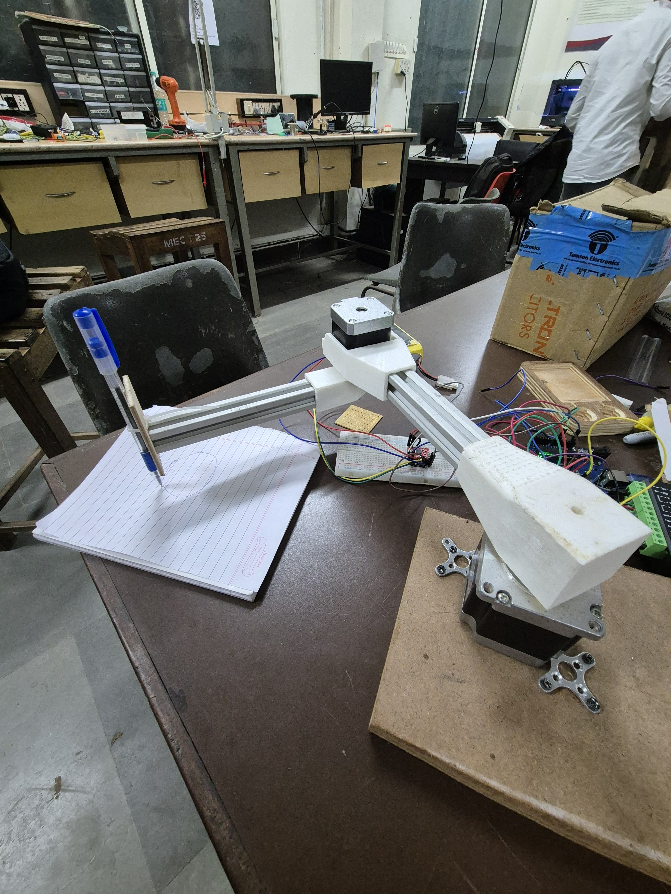
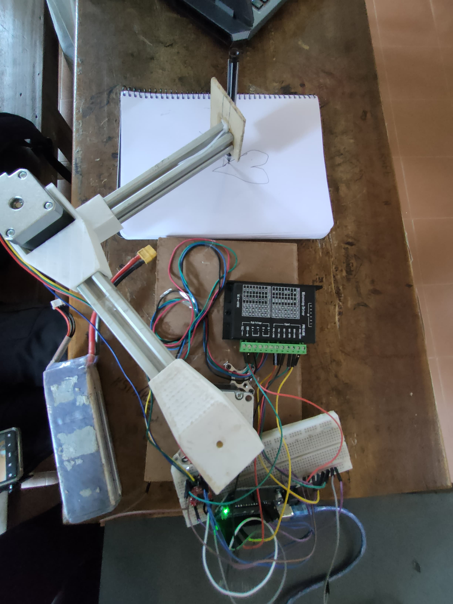

# Vision-Controlled Pen Plotter

A project that began with a simple idea and then turned into build a machine that can take visual input and reproduce it physically with precision.

---

## Getting Started

The first step was understanding how to move a system accurately in two dimensions.At a basic level, this meant choosing the right type of motors.
There are multiple options when it comes to motion systems:

- DC motors: simple to use, but difficult to control precisely  
- Servo motors: allow angular control, but limited for continuous positioning  
- Stepper motors: provide discrete step-based movement, making them suitable for precise positioning  

For this project, stepper motors were the most appropriate choice due to their ability to translate digital commands into controlled motion.

---

## Motion System

The system is based on an X-Y plotting mechanism.Two stepper motors control motion along perpendicular axes, allowing the pen to reach any coordinate within the working area.
The challenge here was not just movement, but controlled and repeatable movement.Small errors in positioning would accumulate and distort the final drawing.

---

## Mechanical Design

Instead of using off-the-shelf structures, we designed the mechanical components ourselves.The design was inspired by existing plotter mechanisms, but adapted and modified to suit our requirements.

All structural components were:

- Designed using CAD tools  
- Optimized for stability and alignment  
- Fabricated using 3D printing  

3D printing gave us the flexibility to iterate quickly and refine the structure based on real-world testing.

---

## Assembly

Once the components were ready, the next step was assembling the system.

This involved:

- Mounting stepper motors securely  
- Aligning axes to ensure smooth motion  
- Attaching the pen holder mechanism  
- Ensuring structural rigidity  

Even minor misalignment caused noticeable errors in drawing, so multiple adjustments were required.

---

## Electronics and Control

The system is controlled using a microcontroller-based setup.

The controller is responsible for:

- Receiving processed input  
- Converting coordinates into step signals  
- Driving the motors through motor drivers  

One of the key challenges was synchronizing both axes so that motion appeared smooth and continuous.

---

## Software and Vision Integration

To make the system more interactive, we introduced a computer vision layer.

Instead of feeding predefined paths, the system processes input using vision techniques and converts it into drawable coordinates.

The pipeline involves:

- Capturing input (image or gesture)  
- Processing and extracting paths  
- Mapping paths into coordinate space  
- Sending commands to the microcontroller  

---

## Challenges Faced

A significant portion of the work went into debugging and refinement.

Some of the major challenges included:

- Mechanical instability leading to drawing distortion  
- Calibration issues between axes  
- Synchronization delays between software and hardware  
- Vibration affecting precision  

Each issue required iterative testing and redesign.

---

## Result

After multiple iterations, the system was able to produce consistent and recognizable drawings.

Seeing the machine translate digital input into physical output was the most rewarding part of the process.

---

## Recognition

This project was presented at a technical fest, where it received:

1st Prize in Project Presentation
Alao we could showcase our project for KSUM exhibition
This recognition validated the effort put into both the design and implementation.

---

## Future Improvements

There are several directions for further development:

- Wireless control and remote operation  
- Multi-color plotting capability  
- Improved calibration and error correction  
- Faster and smoother motion planning  

---
